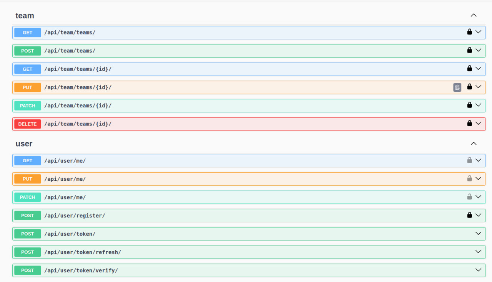

# Teams API Service

Teams API Service is a Django-based RESTful API for managing people and teams. It provides endpoints for creating, updating, and retrieving teams-related data, as well as user registration and people management.

## Table of Contents
- [Introduction](#introduction)
- [Installation](#installation)
- [Endpoints](#endpoints)
- [Presentation](#presentation)

## Introduction

Teams API Service is designed to streamline the management of teams-related data.


## Installation

1. Clone the repository:

   ```
   git clone https://github.com/volodymyr-komarnyckyi/restaurant-test
   ```
2. Create .env file and define environmental variables following .env.example:
   ```
   POSTGRES_HOST= your db host
   POSTGRES_DB= name of your db
   POSTGRES_USER= username of your db user
   POSTGRES_PASSWORD= your db password
   POSTGRES_PORT= your db port
   SECRET_KEY=" your django secret key "
   ```
3. Run command:
   ```
   sudo gpasswd -a $USER docker (Linux)
   newgrp docker (Linux)
   
   docker-compose up --build
   docker ps
   """Choose the last one id"""
   docker exec -it (id) bash
   python manage.py createsuperuser
   ```
4. App will be available at: ```127.0.0.1:8000```

## Endpoints
   ```
   "team" : 
                   "http://127.0.0.1:8000/api/team/teams/"
                   "http://127.0.0.1:8000/api/team/teams/<int:pk>/"
   "member" : 
                   "http://127.0.0.1:8000/api/user/register/"
                   "http://127.0.0.1:8000/api/user/me/"
                   "http://127.0.0.1:8000/api/user/token/"
                   "http://127.0.0.1:8000/api/user/token/refresh/"
   "documentation": 
                   "http://127.0.0.1:8000/api/doc/"
                   "http://127.0.0.1:8000/api/doc/swagger/"
                   "http://127.0.0.1:8000/api/doc/redoc/"
   ```

## Presentation



